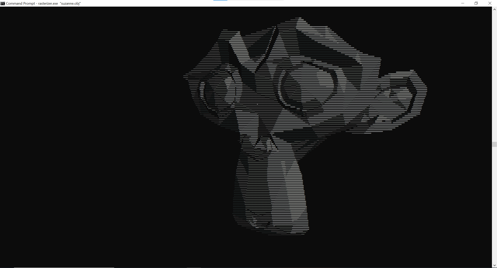

# Software Rasterizer

This project is a software rasterizer that is capable of displaying 3D models (.OBJ files). Traditional triangle rasterization is handled through the hardware of a GPU, so the goal of this project was to be able to load, process, and display a 3D model through software alone.

## Cloning

Since this project's dependencies are managed through Git submodules, the repository should be cloned with the ``--recursive`` flag:

```git clone --recursive https://github.com/Jebbly/Software-Rasterizer.git``

This flag will recursively clone the libraries to their respective folders, where they will later be built as well.

## Building

The CMake build system is used to build this project along with its dependencies. Assuming that CMake has been installed, the following should configure the build:

```
# starting in the parent directory
mkdir build
cd build
cmake ..
```

 Alternatively, Visual Studio Code also has a CMakeTools extension that automatically configures the build for you. Once the files have been generated, you can use the Makefiles to build the project.

## Executing

The application takes in a single argument which should contain the filepath of the 3D model to be rendered:

```
# in the build directory
./rasterizer "[filepath]"
```

If no argument is provided, the application will instead prompt the user to re-run the executable with an additional argument.

When the application is running, the following options should be available:
- ``WASD`` to move forward/backward and sideways
- ``EQ`` to move up or down
- ``IJKL`` to rotate up/down or side-to-side
- ``[]`` to rotate the light around the object
- ``+-`` to increase or decrease movement speed
- ``X`` to close out of the application

## Example

When the project is built, a sample 3D model of [Suzanne the Blender Monkey](https://thegraphicassembly.com/suzanne-blender-monkey-model/) should be copied to the same directory as the executable. Alternatively, you can provide your own filepath to a custom OBJ file. Furthermore, when compiling, the ``WIDTH`` and ``HEIGHT`` dimensions on ``include/framebuffer.hpp`` can be edited according to the dimensions of the terminal.

For example, you can change the font size and layout of the Windows terminal for a more high-resolution render. The following screenshot is rendered in the Windows terminal with font size 6, width 633, and height 149:


## Testing

The CMake should've also configured the Makefile to build to the test suite. Catch2 is used as the testing framework, and can be run by simply calling the executable:

```
./tests
```

## Possible To-Do

The Renderer class is a bit of a God class at the moment. It'd be more flexible to work with if the Controller, Model, and Camera classes were separated from the class and managed independently (perhaps using a Scene class to store Models and a Camera).

It might also be interesting to implement some basic physics or collision detection and an audio library, to see how easily a simple game can be created.

## Credit

This project was created by Jeffrey Liu, Paymon Sadat, and Chase Hari as part of UIUC's CS128 final project.
